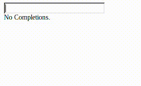

# Input Auto-Complete



1) Create a new Om project using Chestnut

```bash
lein new chestnut auto-complete -- --om-tools --http-kit
cd auto-complete
```

2) Use your editor of choice to open the file `src/cljs/auto_complete/core.cljs`


3) For this demo keep namespace as is.


4) Replace `app-state` with the following:

```clojure
(defonce app-state
  (atom {:user-input ""
         :things ["Apple"
                  "ant"
                  "bird"
                  "CAR, Audi"
                  "crayon"
                  "cooler"
                  "DVD"
                  "Dirt"
                  "DOG, Beagle"]}))
```


5) Create function for handling auto-complete logic.

```clojure
(defn partial-complete
  "Takes a needle and looks for it in the haystack.
Return all matches in a set or nil on empty match set.
Empty needle causes empty match set.
The needle will match any part of the string."
  [needle haystack]
  (when-not (empty? needle)
    (let [pattern (js/RegExp. (str ".* " needle ".*|" needle ".*") "i")]
      (not-empty (set (keep #(re-matches pattern %) haystack))))))
```


6) Create a view that will display the results of the completion function.

```clojure
(defcomponent partial-complete-view [app _]
  (render [_]))
```


7) Add the completion function to the view.

```clojure
(defcomponent partial-complete-view [app _]
  (render
   [_]
   (dom/div
    (if-let [completions (partial-complete (:user-input app) (:things app))]
      (for [thing completions]
        (dom/div {} thing))
      "No Completions."))))
```


8) Add user input field and apply onChange JavaScript event.
   This event should update the application state with `om/update!`.

```clojure
(defcomponent user-input [app _]
  (render
   [_]
   (dom/input {:value (:user-input app)
               :on-change #(om/update! app :user-input (.. % -target -value))})))
```


9) Make a component view that places the user input view above the partial completion view. 

```clojure
(defcomponent auto-complete-view [app _]
  (render
   [_]
   (dom/div
    (om/build user-input app)
    (dom/br {})
    (om/build partial-complete-view app))))
```


10) Replace or alter your main function to display the validation box view.

```clojure
(defn main []
  (om/root
   auto-complete-view
   app-state
   {:target (. js/document (getElementById "app"))}))
```


11) Start a REPL with `lein repl`

```
nREPL server started on port 52193 on host 127.0.0.1 - nrepl://127.0.0.1:52193
REPL-y 0.3.5, nREPL 0.2.6
Clojure 1.6.0
OpenJDK 64-Bit Server VM 1.8.0_31-b13
    Docs: (doc function-name-here)
          (find-doc "part-of-name-here")
  Source: (source function-name-here)
 Javadoc: (javadoc java-object-or-class-here)
    Exit: Control+D or (exit) or (quit)
 Results: Stored in vars *1, *2, *3, an exception in *e
```

12) Call `run` to start the back end and compile your ClojureScript.

```
auto-complete.server=> (run)
Figwheel: Starting server at http://localhost:3449
Figwheel: Serving files from '(resources)/public'
Starting web server on port 10555 .
#<clojure.lang.AFunction$1@a95717>
auto-complete.server=> Compiling "resources/public/js/app.js" from ["env/dev/cljs" "src/cljs"]...
WARNING: No such namespace: auto-complete.core at line 1 env/dev/cljs/auto_complete/main.cljs
Successfully compiled "resources/public/js/app.js" in 20.965 seconds.
notifying browser that file changed:  /js/app.js
notifying browser that file changed:  /js/out/goog/deps.js
notifying browser that file changed:  /js/out/auto_complete/core.js
notifying browser that file changed:  /js/out/auto_complete/main.js
```

13) Point your browser to http://localhost:port. You can find the port in the REPL message output =>  `Starting web server on port ...`
