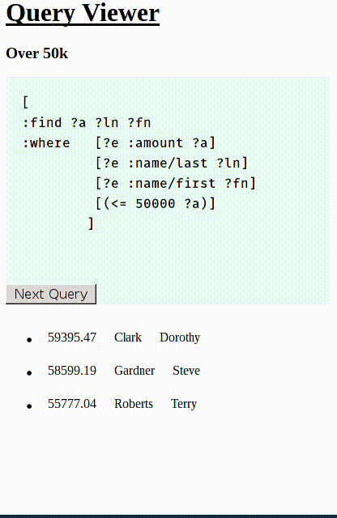

# DataScript Query Browser



1) Create a new Om project using Chestnut

```bash
lein new chestnut datascript-query-browser -- --om-tools --http-kit
```

2) Use your editor of choice to open the file `datascript-query-browser/src/cljs/core.cljs`

3) Your initial app-state should look like this.

```clojure
(ns datascript-query-browser.core
  (:require [om.core :as om :include-macros true]
            [om-tools.dom :as dom :include-macros true]
            [om-tools.core :refer-macros [defcomponent]]
            [datascript :as d]))

(def conn (d/create-conn {}))

(defonce app-state 
  (atom
   {:viewing-query 0
    :queries []
    :query-results []}))
```

4) This demo application requires dummy data called fake-people.

```clojure
(def fake-people
  [{:db/id -1 :name/last "Larson" :name/first "Andrew" :amount 10242.94 } 
   {:db/id -1 :name/last "Richardson" :name/first "Sarah" :amount 26327.99 } 
   {:db/id -1 :name/last "Rice" :name/first "Emily" :amount 35799.79 } 
   {:db/id -1 :name/last "Williams" :name/first "Cheryl" :amount 42043.31 } 
   {:db/id -1 :name/last "Boyd" :name/first "Alan" :amount 18659.8 } 
   {:db/id -1 :name/last "Ryan" :name/first "Donna" :amount 24686.99 } 
   {:db/id -1 :name/last "Hayes" :name/first "Jane" :amount 38395.31 } 
   {:db/id -1 :name/last "Lynch" :name/first "Kathleen" :amount 40031.52 } 
   {:db/id -1 :name/last "White" :name/first "Jane" :amount 16953.81 } 
   {:db/id -1 :name/last "Morgan" :name/first "Joyce" :amount 25542.66 } 
   {:db/id -1 :name/last "Oliver" :name/first "Susan" :amount 35623.38 } 
   {:db/id -1 :name/last "Bradley" :name/first "Jacqueline" :amount 4191.39 } 
   {:db/id -1 :name/last "Gardner" :name/first "Steve" :amount 58599.19 } 
   {:db/id -1 :name/last "Clark" :name/first "Dorothy" :amount 59395.47 } 
   {:db/id -1 :name/last "Roberts" :name/first "Terry" :amount 55777.04 } 
   {:db/id -1 :name/last "Dunn" :name/first "Jeremy" :amount 26784.03 } 
   {:db/id -1 :name/last "Little" :name/first "Robin" :amount 13619.52 } 
   {:db/id -1 :name/last "Fowler" :name/first "Harry" :amount 21089.65 } 
   {:db/id -1 :name/last "Mitchell" :name/first "David" :amount 18071.86 } 
   {:db/id -1 :name/last "Olson" :name/first "Jonathan" :amount 23951.22 } 
   {:db/id -1 :name/last "Hunter" :name/first "Nicholas" :amount 35798.73 } 
   {:db/id -1 :name/last "Lawson" :name/first "Norma" :amount 35146.94 } 
   {:db/id -1 :name/last "Allen" :name/first "William" :amount 6512.05 }])
```
5) Create a function to add the fake people to the db once the main function is loaded.

```clojure
(defn add-fake-people! []
  (doseq [person fake-people]
    (d/transact! conn [person])))
```

6) The same can be done to make dummy queries.

```clojure
(defn query-amount-minimum [n]
  (into '[:find ?a ?ln ?fn
          :where 
          [?e :amount ?a]
          [?e :name/last ?ln]
          [?e :name/first ?fn]]
        [[(list '<= n '?a)]]))

(def queries
  [{:title "Over 10k" :query (query-amount-minimum 10000)}
   {:title "Over 20k" :query (query-amount-minimum 20000)}
   {:title "Over 30k" :query (query-amount-minimum 30000)}
   {:title "Over 40k" :query (query-amount-minimum 40000)}
   {:title "Over 50k" :query (query-amount-minimum 50000)}])

(defn add-queries! [cursor]
  (om/update! cursor [:queries] queries))
```
7) Create a function to load both the dummy data and queries.

```clojure
(defn add-demo-data! [cursor]
  (add-fake-people!)
  (add-queries! cursor))
```

8) Create a function that can cycle through all available queries.

```clojure
(defn next-query! [cursor]
  (let [vqk :viewing-query
        qk :queries
        state cursor
        qc (-> state qk count dec)
        vq (-> state vqk inc)
        vq (if (> vq qc) 0 vq)]
    (om/update! cursor [vqk] vq)))
```

9) Create a function that can fetch the query results.

```clojure
(defn query-results! [cursor]
  (let [{:keys [queries viewing-query]} cursor
        current-query (nth queries viewing-query)
        {:keys [query]} current-query
        results (d/q query @conn)]
    (om/update! cursor [:query-results] results)))
```

10) Create a query view component.

```clojure
(defcomponent query-view [cursor _]
  (will-mount
   [_]
   (add-demo-data! cursor)
   (query-results! cursor))
  (render 
   [_]
   (let [{:keys [queries viewing-query]} cursor
         current-query (nth queries viewing-query)
         {:keys [title query]} current-query]
   (dom/div
    (dom/h1 "Query Viewer")
    (dom/h3 title)
    (dom/div {:style {:font-size "16px"
                      :background-color "hsl(150,80%,95%)"
                      :width "400px"}}
             (dom/pre {:style {:white-space "pre-wrap"
                               :padding "20px"}}
                      (let [r clojure.string/replace]
                        (-> query 
                            pr-str
                            (r ":find" "\n:find")
                            (r ":in" "\n:in")
                            (r ":where" "\n:where\t")
                            (r "]" "]\n\t"))))
             (dom/button {:on-click (fn [_]
                                      (next-query! cursor)
                                      (query-results! cursor))}
                         "Next Query"))))))

```

11) Create a query results component.

```clojure
(defcomponent query-results-view [cursor _]
  (render
   [_]
   (dom/ul 
    (for [qr (:query-results cursor)]
      (dom/li
       (dom/table
        (dom/tr 
         (for [x qr]
           (dom/td {:style {:padding "10px;"}} x)))))))))
```

12) Create a main view component.

```clojure
(defcomponent main-view [app _]
  (render
   [_]
   (dom/div
    (om/build query-view app)
    (om/build query-results-view app))))
```

13) Alter or replace your main function to display the main view component.

```clojure
(defn main []
  (om/root
   main-view
   app-state
   {:target (. js/document (getElementById "app"))}))
```

14) Start a REPL with `lein repl`

```
nREPL server started on port 54879 on host 127.0.0.1 - nrepl://127.0.0.1:54879
REPL-y 0.3.5, nREPL 0.2.6
Clojure 1.6.0
Java HotSpot(TM) 64-Bit Server VM 1.8.0_05-b13
Docs: (doc function-name-here)
(find-doc "part-of-name-here")
Source: (source function-name-here)
Javadoc: (javadoc java-object-or-class-here)
Exit: Control+D or (exit) or (quit)
Results: Stored in vars *1, *2, *3, an exception in *e
```

15) Call `run` to start the back end and compile your ClojureScript.

```
datascript-query-browser.server=> (run)
Starting figwheel.
Starting web server on port 10555 .
#<clojure.lang.AFunction$1@336fc74>
datascript-query-browser.server=> Compiling ClojureScript.
Figwheel: Starting server at http://localhost:3449
Figwheel: Serving files from '(dev-resources|resources)/public'
Compiling "resources/public/js/app.js" from ("src/cljs" "env/dev/cljs")...
Successfully compiled "resources/public/js/app.js" in 18.01 seconds.
notifying browser that file changed:  /js/out/local_state/core.js
```

16) Point your browser to http://localhost:port. You can find the port in the REPL message output =>  `Starting web server on port ...`
