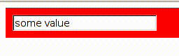

# Color Coded Input Validation



1) Create a new Om project using Chestnut

```bash
lein new chestnut input-validation -- --om-tools --http-kit
```

2) Use your editor of choice to open the file `input-validation/src/cljs/core.cljs`


3) Your initial app-state should look like this.

```clojure
(defonce app-state (atom {:user-input "some value"}))
```
4) Create a user input component

```clojure
(defcomponent user-input-view [app owner]
  (render [_]))
```

5) Make it render an Input element

```clojure
(defcomponent user-input-view [app owner]
  (render
   [_]
   (let [ref "user-input"
         k :user-input]
     (dom/input {:ref ref
                 :value (k app)}))))
```

6) Add an onChange JavaScript event handler. This handler should get the Input element's value and update the application state using `om/update!`

```clojure
(defcomponent user-input-view [app owner]
  (render
   [_]
   (let [ref "user-input"
         k :user-input]
     (dom/input {:ref ref
                 :value (k app)
                 :on-change (fn [_]
                              (let [this (om/get-node owner ref)]
                                (om/update! app [k] (.-value this))))}))))
```

7) Create a new function to validate user input.

```clojure
(defn valid-input?  [x]
  (> 10 (count x)))
```

8) Create a new component that will display a valid or invalid state for the user input.

```clojure
(defcomponent validation-box-view [app _]
  (render [_]))
```

9) The user input view should be parented by the validation view.

```clojure
(defcomponent validation-box-view [app _]
  (render
   [_]
   (dom/div 
    (om/build user-input-view app))))
```

10) Add validation logic and styles.

```clojure
(defcomponent validation-box-view [app _]
  (render
   [_]
   (let [valid-color "green"
         invalid-color "red"
         color (if (valid-input? (:user-input app))
                 valid-color
                 invalid-color)]     
     (dom/div {:style {:padding "10px;"
                       :background-color color}}
              (om/build user-input-view app)))))
```

11) Replace or alter your main function to display the validation box view.

```clojure
(defn main []
  (om/root
   validation-box-view
   app-state
   {:target (. js/document (getElementById "app"))}))
```
12) Start a REPL with `lein repl`

```
nREPL server started on port 54879 on host 127.0.0.1 - nrepl://127.0.0.1:54879
REPL-y 0.3.5, nREPL 0.2.6
Clojure 1.6.0
Java HotSpot(TM) 64-Bit Server VM 1.8.0_05-b13
Docs: (doc function-name-here)
(find-doc "part-of-name-here")
Source: (source function-name-here)
Javadoc: (javadoc java-object-or-class-here)
Exit: Control+D or (exit) or (quit)
Results: Stored in vars *1, *2, *3, an exception in *e
```

13) Call `run` to start the back end and compile your ClojureScript.

```
input-validation.server=> (run)
Starting figwheel.
Starting web server on port 10555 .
#<clojure.lang.AFunction$1@336fc74>
input-validation.server=> Compiling ClojureScript.
Figwheel: Starting server at http://localhost:3449
Figwheel: Serving files from '(dev-resources|resources)/public'
Compiling "resources/public/js/app.js" from ("src/cljs" "env/dev/cljs")...
Successfully compiled "resources/public/js/app.js" in 18.01 seconds.
notifying browser that file changed:  /js/out/local_state/core.js
```

14) Point your browser to http://localhost:port. You can find the port in the REPL message output =>  `Starting web server on port ...`


