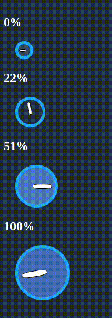

# Circle Rotation Knobs



1) Create a new Om project using Chestnut

```bash
lein new chestnut knob -- --om-tools --http-kit
```

2) Use your editor of choice to open the file `knob/src/cljs/core.cljs`


3) Your initial app-state should look like this.

```clojure
(ns knob.core
  (:require-macros [cljs.core.async.macros :refer [go go-loop]])
  (:require [om.core :as om :include-macros true]
            [om-tools.dom :as dom :include-macros true]
            [om-tools.core :refer-macros [defcomponent]]))

(defonce app-state
  (atom
   {:panel {:bg-color "#22313F"
            :font-color "white"}
    :knobs [{:id "a" :deg 0 :size 10 :color "#34495E" :border "#22A7F0"}
            {:id "b" :deg 80 :size 20 :color "#22313F" :border "#22A7F0"}
            {:id "c" :deg 180 :size 30 :color "#4B77BE" :border "#22A7F0"}
            {:id "d" :deg 350 :size 40 :color "#446CB3" :border "#22A7F0"}]}))
```

4) Since each knob is going to be round, there needs to be a function that can determine which quandrant of a circle is being activated.

```clojure
(defn quadrant [y x rect]
  (let [half #(-> % (* 0.5) int)
        top (.-top rect)
        bottom (.-bottom rect)
        left (.-left rect)
        right (.-right rect)
        x-half (half (- right left))
        x (- x left)
        y-half (half (- bottom top))
        y (- y top)
        y-pos (if (<= y y-half) :up :down)
        x-pos (if (>= x x-half) :right :left)]
    [y-pos x-pos]))
```

5) Knowing the quadrant doesn't give the mouse direction. A function needs to be made to compare the previous and current mouseover quadrant.

```clojure
(defn direction
  [cursor y quadrant]
  (let [state @cursor
        {:keys [last-quadrant last-y]} state
        up? (< y last-y)
        direction [up? last-quadrant quadrant]]
    
    (condp = direction
      
      ;; increase top left to right
      [true [:up :left] [:up :left]] inc
      [false [:up :left] [:up :right]] inc
      [true [:up :left] [:up :right]] inc
      [false [:up :right] [:up :right]] inc
      [false [:up :right] [:down :right]] inc
      
      ;; increase bottom right to left
      [false [:down :right] [:down :right]] inc
      [false [:down :right] [:down :left]] inc
      [true [:down :left] [:down :left]] inc
      [false [:down :left] [:down :left]] dec
      
      ;; decrease bottom left to right
      [false [:down :left] [:down :right]] dec      
      [true [:down :right] [:down :right]] dec
      [true [:down :right] [:up :right]] dec
      
      ;; decrease up right to left
      [true [:up :right] [:up :right]] dec
      [true [:up :right] [:up :left]] dec
      [false [:up :left] [:up :left]] dec      
      
      identity)))
```

6) Create your mouse event handlers

```clojure
(defn mouse-move! [cursor evt]
  (go-loop [state @cursor]
    (when (:mouse-down? state)
      (let [dk :deg
            yk :last-y
            lqk :last-quadrant
            rect (-> js/document
                     (.getElementById (:id state))
                     .getBoundingClientRect)
            y (.-clientY evt)
            x (.-clientX evt)
            q (quadrant y x rect)
            f (direction cursor y q)]
        (om/transact! cursor
                      (fn [state]
                        (-> state
                            (update-in [dk]
                                       (fn [deg]
                                         (if (and (<= deg 350)
                                                  (>= deg 0))
                                           (f deg))))
                            (assoc-in [lqk] q)
                            (assoc-in [yk] y))))))))

(defn mouse-down! [cursor evt]
  (go
    (om/update! cursor [:mouse-down?] (-> evt .-button zero?))))

(defn mouse-up! [cursor evt]
  (go
    (om/update! cursor [:mouse-down?] false)))
```
7) Create your knob view

```clojure
(defcomponent knob-view [cursor _]
  (did-mount
   [_]
   (let [node (-> js/document
                  (.getElementById (:id cursor)))]
     (-> node .-onmousemove (set! #(mouse-move! cursor %)))
     (-> node .-onmousedown (set! #(mouse-down! cursor %)))
     (-> node .-onmouseup (set! #(mouse-up! cursor %)))))
  (render
   [_]
   (let [{:keys [id deg size color border]} cursor
         rotate (str "rotate(" deg "deg)")
         width (* 1.5 size)
         height width
         padding (* size 0.30)
         stick-width (* width 0.35)
         stick-margin-top (* padding 2)
         stick-margin-left (str "-" (* padding 0.5))
         percent (-> (/ deg 350) (* 100) int)]
     (dom/div
      (dom/h2  (str percent "%"))
      (dom/div {:id id
                :style {:margin "20px"
                        :border-color border
                        :border-style "solid"
                        :border-width "5px"
                        :padding padding
                        :border-radius "50%"
                        :transform rotate
                        :width width
                        :height height
                        :background-color color}}
               (dom/div {:style {:margin-top stick-margin-top
                                 :margin-left stick-margin-left
                                 :padding-right stick-width
                                 :padding-left stick-width
                                 :height "15%"
                                 :border-radius "35%"
                                 :background-color "white"
                                 :border-color "black"
                                 :border-style "solid"
                                 :border-width "1px"
                                 :float "left"}}))))))
```

8) Create a main view to build all available knobs.

```clojure
(defcomponent main-view [app owner]
  (render
   [_]
   (dom/div {:style {:background-color (-> app :panel :bg-color)
                     :color (-> app :panel :font-color)
                     :padding "10px"}}
            (om/build-all knob-view (:knobs app)))))
```
10) Replace or alter your main function to display the validation box view.

```clojure
(defn main []
  (om/root
   main-view
   app-state
   {:target (. js/document (getElementById "app"))}))
```
11) Start a REPL with `lein repl`

```
nREPL server started on port 54879 on host 127.0.0.1 - nrepl://127.0.0.1:54879
REPL-y 0.3.5, nREPL 0.2.6
Clojure 1.6.0
Java HotSpot(TM) 64-Bit Server VM 1.8.0_05-b13
Docs: (doc function-name-here)
(find-doc "part-of-name-here")
Source: (source function-name-here)
Javadoc: (javadoc java-object-or-class-here)
Exit: Control+D or (exit) or (quit)
Results: Stored in vars *1, *2, *3, an exception in *e
```

12) Call `run` to start the back end and compile your ClojureScript.

```
knob.server=> (run)
Starting figwheel.
Starting web server on port 10555 .
#<clojure.lang.AFunction$1@336fc74>
knob.server=> Compiling ClojureScript.
Figwheel: Starting server at http://localhost:3449
Figwheel: Serving files from '(dev-resources|resources)/public'
Compiling "resources/public/js/app.js" from ("src/cljs" "env/dev/cljs")...
Successfully compiled "resources/public/js/app.js" in 18.01 seconds.
notifying browser that file changed:  /js/out/local_state/core.js
```

13) Point your browser to http://localhost:port. You can find the port in the REPL message output =>  `Starting web server on port ...`


