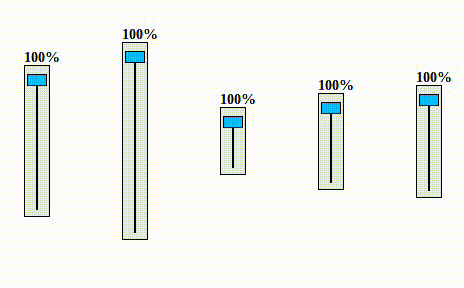

# Custom Scrolling Bar



1) Create a new Om project using Chestnut

```bash
lein new chestnut scrollbar -- --om-tools --http-kit
```

2) Use your editor of choice to open the file `scrollbar/src/cljs/core.cljs`


3) Your initial app-state should look like this.

```clojure
(ns scrollbar.core
  (:require-macros [cljs.core.async.macros :refer [go go-loop]])
  (:require [om.core :as om :include-macros true]
            [om-tools.dom :as dom :include-macros true]
            [om-tools.core :refer-macros [defcomponent]]))


(def app-state 
  (atom {:scrollbars []}))
```
4) Create a function that generates a scrollbar.

```clojure
(defn add-sample-scrollbar! [cursor]
  (let [id (gensym)
        sb {:scroller-id (str "scroller" id)
            :slider-track-id (str "slider-track" id)
            :scrollbar-id (str "scrollbar" id)
            :scrollbar-height (rand-nth (range 40 200))
            :scrollbar 100
            :scrolling false}]
    (om/transact! cursor
                  [:scrollbars]
                  (fn [coll]
                    (conj coll sb)))))
```
5) Create mouse up/down event handlers

```clojure
(defn scrollbar-mouse-down! [cursor]
  (go 
    (om/update! cursor [:scrolling] true)))

(defn scrollbar-mouse-up! [cursor]
  (go 
    (om/update! cursor [:scrolling] false)))
```

6) Create a function to change the scroll percent.

```clojure
(defn scrollbar-percent! [cursor percent]
  (om/update! cursor [:scrollbar] percent))
```

7) The mouse move event handler should update the scroller percent value and positon when `(:scrolling state)`.

```clojure
(defn scrollbar-mouse-move! [evt cursor]
  (go-loop [state @cursor
            scroller-node (-> js/document
                              (.getElementById (:scroller-id state)))
            slider-track (-> js/document
                             (.getElementById (:slider-track-id state)))
            y (- (.-clientY evt) 8)
            yp (str y "px")
            true-offset (-> slider-track .getBoundingClientRect .-top)
            true-y (- y true-offset)
            full (:scrollbar-height state)
            percent (->> (/ true-y full)
                         (* 100)
                         (- 100)
                         int)]                        
    (when (and (:scrolling state)
               (>= 100 percent)
               (>= percent 0))
      (-> scroller-node
          .-style.top
          (set! yp))
      (scrollbar-percent! cursor percent))))
```

8) Add the event handlers to the scroll bar view

```clojure
(defcomponent scrollbar-view [cursor _]
  (did-mount
   [_]
   (let [scroller-node (-> js/document
                           (.getElementById (:scroller-id cursor)))
         scrollbar-node (-> js/document
                            (.getElementById (:scrollbar-id cursor)))]
     ;; set scrolling
     (doseq [node [scroller-node
                   scrollbar-node]]
       (-> node
           .-onmousedown
           (set! (fn [_] (scrollbar-mouse-down! cursor)))))

     ;; set not scrolling     
     (doseq [node [scroller-node
                   scrollbar-node]]       
       (-> node
           .-onmouseup
           (set! (fn [_] (scrollbar-mouse-up! cursor)))))

     ;; set movement listener
     (doseq [node [scroller-node
                   scrollbar-node]]       
       (-> node
           .-onmousemove
           (set! (fn [evt] (scrollbar-mouse-move! evt cursor)))))))         
  (render
   [_]
   (let [height-px (str (:scrollbar-height cursor) "px")]
     (dom/span
      (dom/b (str (:scrollbar cursor) "%"))
      (dom/div {:id (:scrollbar-id cursor)
                :style {:width "20px"
                        :height height-px
                        :padding "8px 2px 8px 2px"
                        :border-width "1px"
                        :border-color "#000"
                        :border-style "solid"
                        :background-color "hsl(190,15%,90%)"}}             
               (dom/div {:id (:slider-track-id cursor)
                         :style {:float "left"
                                 :padding "1px"
                                 :height height-px
                                 :margin-left "9px"
                                 :background-color "#000"}})            
               (dom/div {:id (:scroller-id cursor)
                         :style {:width "18px"
                                 :height "10px"
                                 :position "absolute"
                                 :background-color "hsl(195,100%,50%)"
                                 :border-width "1px"
                                 :border-style "solid"
                                 :border-color "#000"}}))))))
```

9) The main view should generate 10 scrollbars with each being of a random height.

```clojure
(defcomponent main-view [app owner]
  (will-mount
   [_]
   (dotimes [_ 10]
     (add-sample-scrollbar! app)))
  (render
   [_]
   (dom/table
    (dom/tr
     (for [sb (:scrollbars app)]
       (dom/td {:style {:padding 30}}
               (om/build scrollbar-view sb)))))))
```

10) Replace or alter your main function to display the main view

```clojure
(defn main []
  (om/root
   main-view
   app-state
   {:target (. js/document (getElementById "app"))}))
```
11) Start a REPL with `lein repl`

```
nREPL server started on port 54879 on host 127.0.0.1 - nrepl://127.0.0.1:54879
REPL-y 0.3.5, nREPL 0.2.6
Clojure 1.6.0
Java HotSpot(TM) 64-Bit Server VM 1.8.0_05-b13
Docs: (doc function-name-here)
(find-doc "part-of-name-here")
Source: (source function-name-here)
Javadoc: (javadoc java-object-or-class-here)
Exit: Control+D or (exit) or (quit)
Results: Stored in vars *1, *2, *3, an exception in *e
```

12) Call `run` to start the back end and compile your ClojureScript.

```
scrollbar.server=> (run)
Starting figwheel.
Starting web server on port 10555 .
#<clojure.lang.AFunction$1@336fc74>
scrollbar.server=> Compiling ClojureScript.
Figwheel: Starting server at http://localhost:3449
Figwheel: Serving files from '(dev-resources|resources)/public'
Compiling "resources/public/js/app.js" from ("src/cljs" "env/dev/cljs")...
Successfully compiled "resources/public/js/app.js" in 18.01 seconds.
notifying browser that file changed:  /js/out/local_state/core.js
```

13) Point your browser to http://localhost:port. You can find the port in the REPL message output =>  `Starting web server on port ...`
