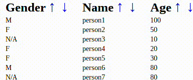

# Single Attribute Sortable Table



1) Create a new Om project using Chestnut

```bash
lein new chestnut sortable-table -- --om-tools --http-kit
```

2) Use your editor of choice to open the file `sortable-table/src/cljs/core.cljs`


3) Your initial app-state should look like this.

```clojure
(defonce app-state 
  (atom
   {:table [{:gender "M" :name "person1" :age 100}
            {:gender "F" :name "person2" :age 50}
            {:gender "N/A" :name "person3" :age 10}
            {:gender "F" :name "person4" :age 20}
            {:gender "F" :name "person5" :age 30}
            {:gender "M" :name "person6" :age 80}
            {:gender "N/A" :name "person7" :age 80}]}))
```

4) Define state in your local component to store sort settings

```clojure
(init-state [_] {:sort :nil
                 :sort-dir nil})
```

5) Define a way to change the sort order and key

``` clojure
(defn change-sorting [owner key]
  ;; invert direction on second click
  (when (= (om/get-state owner :sort) key)
    (om/set-state! owner :sort-dir (not (om/get-state owner :sort-dir))))
  (om/set-state! owner :sort key))
```

6) Set up the function to sort the data

``` clojure
(defn sorted-data [key direction data]
  (if key
    ((if direction reverse identity)
     (sort-by key data))
    data))
```

7) Create a table view header component

```clojure
(defcomponent table-view-header [{:keys [header]} _]
  (render [_]))
```

8) Add header element with a fn that changes the sort setting

```clojure
(defcomponent table-view-header [{:keys [header sort-fn]} _] 
  (render
   [_]
   (let [header-name (name header)
         header-kw (keyword header-name)
         attr {:href "javascript:void(0);"
               :style {:margin "5px;"
                       :font-size "30px;"
                       :text-decoration "none;"}
               :on-click sort-fn}
         header-attr {:style {:padding-right "20px;"
                              :font-size "25px;"}}]
     (dom/th header-attr
             (clojure.string/capitalize header-name)
             ;; UTF-8 Up/Down Arrow
             (dom/a attr "⬍")))))
```

8) Create a table row component

```clojure
(defcomponent table-row [row owner]
  (render 
   [_]
   (dom/tr
    (for [value (map val row)]
      (dom/td value)))))
```

9) Define a function that gets the table headers and adds the sort key

```clojure
(defn header-types [data sort-fn]
  (map #(hash-map :header % :sort-fn (partial sort-fn %))
       (-> data
           first
           keys)))
```

10) Create a component that builds the table's header and rows.
This table component holds the local sort state.
The partial is being used to draft a function that is called with the "owern" from this scope and the header key from the header-types scope

```clojure
(defcomponent table-view [data owner]
  (init-state [_] {:sort :nil
                   :sort-dir nil})
  (render-state
   [_ state]   
   (dom/table
      (dom/tr
       (om/build-all table-view-header (header-types data (partial change-sorting owner))))
      (om/build-all table-row
                    (sorted-data (:sort state)
                                 (:sort-dir state)
                                 data)))))
```

11) Define the view that holds the table, and hand it the app state cursor

(defcomponent main-view [app-state]
  (render [_]
          (om/build table-view (:table app-state))))

12) Display the main view

```clojure
(defn main []
  (om/root
   main-view
   app-state
   {:target (. js/document (getElementById "app"))}))
```

13) Start a REPL with `lein repl`

```
nREPL server started on port 54879 on host 127.0.0.1 - nrepl://127.0.0.1:54879
REPL-y 0.3.5, nREPL 0.2.6
Clojure 1.6.0
Java HotSpot(TM) 64-Bit Server VM 1.8.0_05-b13
Docs: (doc function-name-here)
(find-doc "part-of-name-here")
Source: (source function-name-here)
Javadoc: (javadoc java-object-or-class-here)
Exit: Control+D or (exit) or (quit)
Results: Stored in vars *1, *2, *3, an exception in *e
```

14) Call `run` to start the back end and compile your ClojureScript.

```
sortable-table.server=> (run)
Starting figwheel.
Starting web server on port 10555 .
#<clojure.lang.AFunction$1@336fc74>
sortable-table.server=> Compiling ClojureScript.
Figwheel: Starting server at http://localhost:3449
Figwheel: Serving files from '(dev-resources|resources)/public'
Compiling "resources/public/js/app.js" from ("src/cljs" "env/dev/cljs")...
Successfully compiled "resources/public/js/app.js" in 18.01 seconds.
notifying browser that file changed:  /js/out/local_state/core.js
```

15) Point your browser to http://localhost:port. You can find the port in the REPL message output =>  `Starting web server on port ...`

